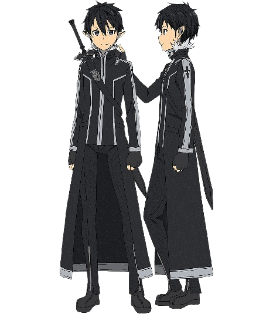
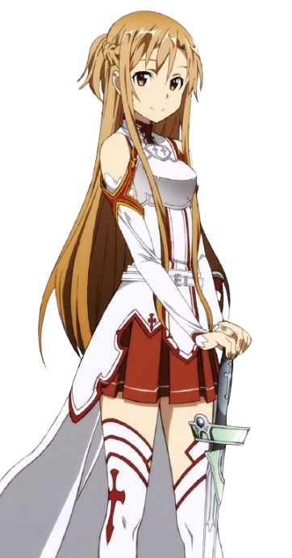
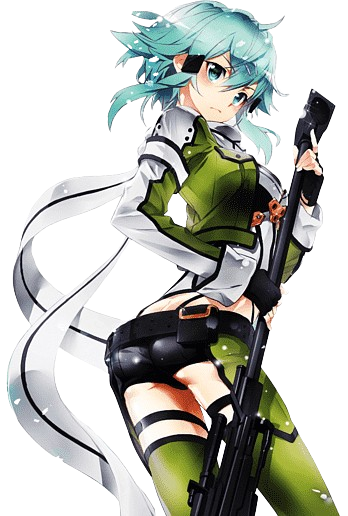

# app-dev
My first repository
🌸 Sword Art Online

Genre: Action, Adventure, Fantasy, Romance
Created by: Reki Kawahara

🎮 Summary

“Sword Art Online” is a Japanese anime series where players get trapped inside a virtual reality MMORPG.
If they die in the game, they die in real life.
The story follows Kirito, a skilled gamer, and Asuna, a brave fighter, as they battle to escape the virtual world.

💫 Main Characters

Kirito (Kazuto Kirigaya) – The main protagonist, known for his speed and sword skills.

Asuna Yuuki – Kirito’s partner, a strong and graceful fighter.

Sinon – A sniper expert introduced in later arcs.

Alice Zuberg – A key character in the Alicization arc.

⚔️ My Favorite Moments

When Kirito dual-wields swords for the first time.

The emotional reunion of Kirito and Asuna after escaping Aincrad.

The breathtaking battles in Alicization.

📺 Why I Love It

Beautiful animation and world-building.

Touching romance between Kirito and Asuna.

Exciting blend of technology and fantasy.

📎 Fun Fact

You can watch Sword Art Online on Crunchyroll
 or Netflix
.
# Sword Art Online ⚔️

> *"In this world, a game over means death in real life."*

## 📖 Overview
**Sword Art Online (SAO)** is a Japanese light novel series written by *Reki Kawahara* and illustrated by *abec*.  
The story is set in the near future where players get trapped inside a **virtual reality MMORPG**, and dying in the game means dying in real life.

---

## 🧍 Main Characters
1. **Kirito** *(Kazuto Kirigaya)* – The main protagonist and a skilled solo player.

  

2. **Asuna** *(Asuna Yuuki)* – Kirito’s partner and one of the strongest players in SAO.
   

3. **Sinon** – A sharpshooter in Gun Gale Online.

4. **Leafa** – Kirito’s cousin and ally in ALfheim Online.
   

---

## Series Overview
| Season | Game World | Year Released |
|:-------|:------------|:--------------|
| Season 1 | Sword Art Online | 2012 |
| Season 2 | Gun Gale Online | 2014 |
| Alicization | Underworld | 2018 |
| War of Underworld | Underworld | 2019 |

---

## 💭 Why I Love It
- Amazing story concept about **virtual reality and survival**.  
- Great **character development** and emotional moments.  
- Stunning **action and visuals**.  
- Themes of friendship, courage, and love.

---

## 🔗 Useful Links
- [Official Website](https://swordart-online.net/)
- [SAO on MyAnimeList](https://myanimelist.net/anime/11757/Sword_Art_Online)
- [Markdown Cheat Sheet](https://www.markdownguide.org/cheat-sheet/)

---

*Written by a Sword Art Online fan 💙*
