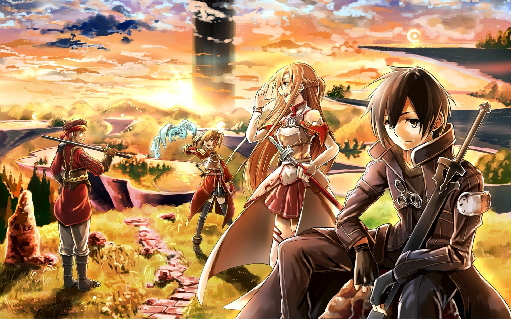

# app-dev
My first repository
# Sword Art Online ⚔️

> *"In this world, a game over means death in real life."*

## 📖 Overview
**Sword Art Online (SAO)** is a Japanese light novel series written by *Reki Kawahara* and illustrated by *abec*.  
The story is set in the near future where players get trapped inside a **virtual reality MMORPG**, and dying in the game means dying in real life.

---

## 🧍 Main Characters
1. **Kirito** *(Kazuto Kirigaya)* – The main protagonist and a skilled solo player.  
2. **Asuna** *(Asuna Yuuki)* – Kirito’s partner and one of the strongest players in SAO.  
3. **Sinon** – A sharpshooter in Gun Gale Online.  
4. **Leafa** – Kirito’s cousin and ally in ALfheim Online.

---

## Series Overview
| Season | Game World | Year Released |
|:-------|:------------|:--------------|
| Season 1 | Sword Art Online | 2012 |
| Season 2 | Gun Gale Online | 2014 |
| Alicization | Underworld | 2018 |
| War of Underworld | Underworld | 2019 |

---

## 💭 Why I Love It
- Amazing story concept about **virtual reality and survival**.  
- Great **character development** and emotional moments.  
- Stunning **action and visuals**.  
- Themes of friendship, courage, and love.

---

## 🔗 Useful Links
- [Official Website](https://swordart-online.net/)
- [SAO on MyAnimeList](https://myanimelist.net/anime/11757/Sword_Art_Online)
- [Markdown Cheat Sheet](https://www.markdownguide.org/cheat-sheet/)

---

*Written by a Sword Art Online fan 💙*
